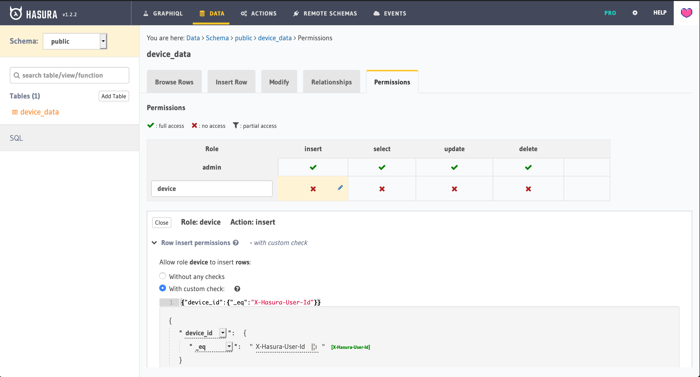
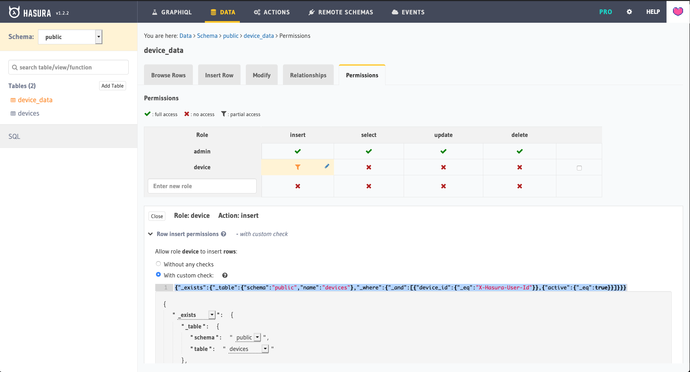

# hasura-connect

Hasura connector with MQTT
hasura-connect cli helps us to connect MQTT broker with hasura graphql engine securely just with 2 commands.

This project also supports [eclipse-sparkplug ](https://www.eclipse.org/tahu/spec/Sparkplug%20Topic%20Namespace%20and%20State%20ManagementV2.2-with%20appendix%20B%20format%20-%20Eclipse.pdf) payload specification. set `MODE='spBv1.0'` to enable this.

[](https://oclif.io)
[](https://npmjs.org/package/hasura-connect)
[](https://npmjs.org/package/hasura-connect)
[](https://github.com/soorajshankar/hasura-connect/blob/master/package.json)

<!-- toc -->
* [hasura-connect](#hasura-connect)
* [Usage](#usage)
* [Commands](#commands)
<!-- tocstop -->

# Usage

<!-- usage -->
```sh-session
$ npm install -g hasura-connect
$ hasura-connect COMMAND
running command...
$ hasura-connect (-v|--version|version)
hasura-connect/0.3.1 darwin-x64 node-v14.2.0
$ hasura-connect --help [COMMAND]
USAGE
  $ hasura-connect COMMAND
...
```
<!-- usagestop -->

# Commands

<!-- commands -->
* [`hasura-connect connect`](#hasura-connect-connect)
* [`hasura-connect help [COMMAND]`](#hasura-connect-help-command)
* [`hasura-connect init`](#hasura-connect-init)

## `hasura-connect connect`

Describe the command here

```
USAGE
  $ hasura-connect connect

OPTIONS
  -d, --debug  pass true to enable debugging

DESCRIPTION
  ...
  Extra documentation goes here
```

_See code: [src/commands/connect.js](https://github.com/soorajshankar/hasura-connect/blob/v0.3.1/src/commands/connect.js)_

## `hasura-connect help [COMMAND]`

display help for hasura-connect

```
USAGE
  $ hasura-connect help [COMMAND]

ARGUMENTS
  COMMAND  command to show help for

OPTIONS
  --all  see all commands in CLI
```

_See code: [@oclif/plugin-help](https://github.com/oclif/plugin-help/blob/v3.1.0/src/commands/help.ts)_

## `hasura-connect init`

init command used to intialise hasura connect configuration file at the current directory

```
USAGE
  $ hasura-connect init

OPTIONS
  -c, --MQTT_CHANNEL=MQTT_CHANNEL  MQTT channel
  -h, --HASURA_HOST=HASURA_HOST    hasura host url
  -m, --MODE=MODE                  mode : sparkplug or normal
  -m, --MQTT_HOST=MQTT_HOST        mqtt host url

DESCRIPTION
  ...
```

_See code: [src/commands/init.js](https://github.com/soorajshankar/hasura-connect/blob/v0.3.1/src/commands/init.js)_
<!-- commandsstop -->


# Configuring Hasura GraphQL Engine.
> Note : The following setup is indented to give a basic idea of setting up Hasura Engine for accepting data ingestions, you may design your tables/mutations as per your business logic 
## Setting up the DB

This project currently support only one Mutation (insert_device_data).
To setup the table

-   Go to Hasura Console > Data > SQL
-   Run & Track the following SQL to create a table and setup the mutation

```sql
CREATE TABLE "public"."device_data"("id" serial NOT NULL, "data" jsonb NOT NULL, "timestamp" timestamptz NOT NULL, "device_id" text NOT NULL, PRIMARY KEY ("id") );
```

## Authorization

Considering we use mutations, set of headers we pass is as follows

```
      "X-Hasura-Role": "device",
      "X-Hasura-User-Id": <device_id>,
```

`device_id`: Used here is directly parsed from the sparkplug topic.

So any custom permissions can be set on the hasura cloud with a role `device`. We recommend to use any of the following approaches.

<!-- toc -->

-   [Allow from all device](#Allow-from-all-device)
-   [Allow only from Registered devices](#Allow-only-from-Registered-devices)
<!-- tocstop -->

### Allow from all device

Following permission will allow `hasura-connect` to make mutation from any device_id.



### Allow only from Registered devices

For doing this, we need to create one more table to store the information of registered devices. This will ensure that Hasura allows the mutations only from the registered devices.

-   Run & Track the following SQL

```sql
CREATE TABLE "public"."devices"("id" serial NOT NULL, "device_id" text NOT NULL, "active" boolean NOT NULL DEFAULT true, PRIMARY KEY ("id") );
```

-   Add device information to the newly created table.
-   Setup Permissions for `device_data` insert.

```json
{
	"_exists": {
		"_table": { "schema": "public", "name": "devices" },
		"_where": {
			"_and": [
				{ "device_id": { "_eq": "X-Hasura-User-Id" } },
				{ "active": { "_eq": true } }
			]
		}
	}
}
```



Above permission will make sure that the mutation is only allowed if the device is registered in the devices table.

# Roadmap

-   [ ] More configurations
-   [ ] Support other streams (Apache Kafka, Apache NiFi, Other MQs, SNS, GCM etc.)
-   [ ] Batch mutaions for better performance
-   [ ] support custom MQTT payload spec
-   [ ] make a Demo app (a digital twin/ realtime chart :?)
-   [ ] Performance test & optimisation
-   [ ] Dockerization 
-   [ ] CI implementaion
